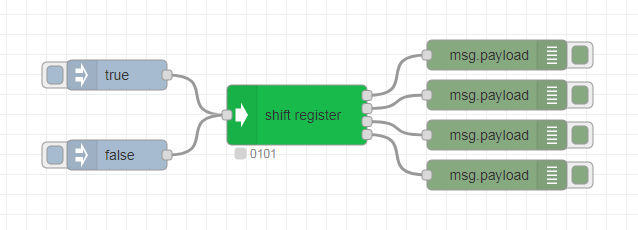

# node-red-contrib-shift-register

A shift register for Node-RED, where changes of single bits are reported via a corresponding output.

Features:

- Number of outputs adjustable
- Format of outgoing messages configurable

## Installation

Open Node-RED and select `Manage palette` from the menu to open the Palette Manager. Go to the `Install` tab, search for `node-red-contrib-shift-register` and click `install`.

Alternatively, you can run the following command in your Node-RED user directory (typically `~/.node-red`):

```
npm i node-red-contrib-shift-register
```

## Example



```
[{"id":"6ec7d47a.c27d8c","type":"tab","label":"Flow 2","disabled":false,"info":""},{"id":"bcf8db0f.ebb338","type":"shift register","z":"6ec7d47a.c27d8c","name":"","topic":"","outputs":4,"output":"1","x":530,"y":460,"wires":[["6d6abdf1.ce60d4"],["97f2a4d6.7ad3e8"],["ff6a5eb.cd8c9a"],["8fbf342f.e732e8"]]},{"id":"7a727a5c.04f504","type":"inject","z":"6ec7d47a.c27d8c","name":"","props":[{"p":"payload"},{"p":"topic","vt":"str"}],"repeat":"","crontab":"","once":false,"onceDelay":0.1,"topic":"","payload":"true","payloadType":"bool","x":350,"y":420,"wires":[["bcf8db0f.ebb338"]]},{"id":"ab634aea.860ea8","type":"inject","z":"6ec7d47a.c27d8c","name":"","props":[{"p":"payload"},{"p":"topic","vt":"str"}],"repeat":"","crontab":"","once":false,"onceDelay":0.1,"topic":"","payload":"false","payloadType":"bool","x":350,"y":500,"wires":[["bcf8db0f.ebb338"]]},{"id":"6d6abdf1.ce60d4","type":"debug","z":"6ec7d47a.c27d8c","name":"","active":true,"tosidebar":true,"console":false,"tostatus":false,"complete":"false","statusVal":"","statusType":"auto","x":730,"y":400,"wires":[]},{"id":"97f2a4d6.7ad3e8","type":"debug","z":"6ec7d47a.c27d8c","name":"","active":true,"tosidebar":true,"console":false,"tostatus":false,"complete":"false","statusVal":"","statusType":"auto","x":730,"y":440,"wires":[]},{"id":"ff6a5eb.cd8c9a","type":"debug","z":"6ec7d47a.c27d8c","name":"","active":true,"tosidebar":true,"console":false,"tostatus":false,"complete":"false","statusVal":"","statusType":"auto","x":730,"y":480,"wires":[]},{"id":"8fbf342f.e732e8","type":"debug","z":"6ec7d47a.c27d8c","name":"","active":true,"tosidebar":true,"console":false,"tostatus":false,"complete":"false","statusVal":"","statusType":"auto","x":730,"y":520,"wires":[]}]
```

## License

[MIT](LICENSE)